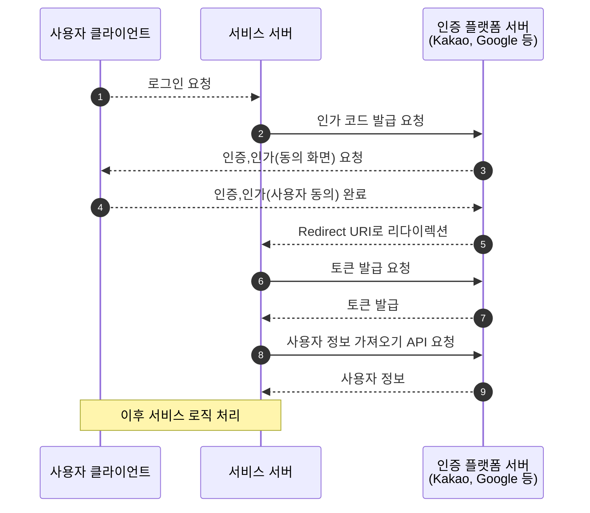
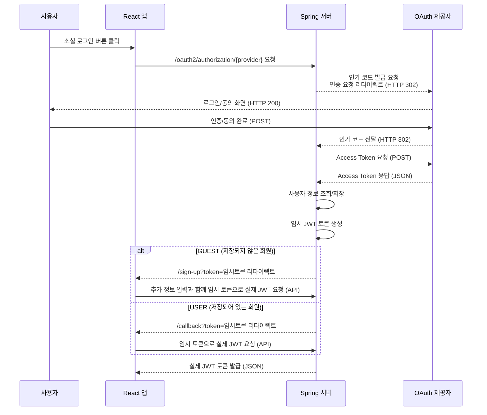

이제는 소셜로그인을 지원하지 않는 서비스를 찾는 것이 더 어려워졌다. 어찌보면 당연한 현상이다. 서비스별로 아이디와 암호를 모두 외우는 대신 계정 하나의 아이디와 암호만 외우는 게 이용자로 하여금 훨씬 쉽기 때문에 그만큼 빠르게 보급되었다.
이 소셜로그인은 바로 지난 포스트에서 알아본 [OAuth](https://hyunmuam.github.io/posts/start-oauth)와 [OIDC(OpenID Connect)](https://hyunmuam.github.io/posts/oidc)를 통해서 구현되는 기능이다. 이번 포스팅에서는 Spring을 이용하여 직접 소셜로그인을 구현해보고, 그 동작원리를 이해해보고자 한다.

## 프로젝트 개요
---
예제 프로젝트는 한개 이상의 소셜로그인을 지원하며 로그인하게되면 로그인한 아이디의 회원 정보(프로필 사진, 이메일, 이름)을 보여주는 간단한 프로젝트이다.

Spring Boot로 구현된 REST API 서버와 React로 구현된 클라이언트가 분리된 구조로 개발하였으며 이번 포스팅에서는 Spring을 중점적으로 다룬다.


## 앱 등록 및 키 발급
---
소셜로그인은 사용자의 개인정보를 외부 서비스에 제공하는 것이다. 아무에게나 사용자의 정보를 제공하게된다면 문제가 될 것 이다. 그렇기 때문에 소셜로그인을 제공하는 플랫폼은 사용자의 개인정보를 보호하기 위해 신뢰할 수 있는 서비스에게만 사용자 데이터 접근을 허용해준다.

내가 구현한 서비스가 신뢰할 수 있는 애플리케이션이라는 것을 알리는 방법이 바로 앱을 등록이다. 이를 통해 개발자는 애플리케이션의 정체성을 명확히 밝히고, 어떤 사용자 정보에 접근할지 명시한다.

그리고 그 결과로 플랫폼에서 접근을 허용해주는 `client_id`와 `client_secret`을 전달하여 접근을 허용해준다.

> 간단한 앱 등록 방식은 아래 주소에 정리해두었다.<br>[Google 앱 등록](https://github.com/hyunmuam/blog-code/blob/main/start-oauth/docs/google.md)<br>[Kakao 앱 등록](https://github.com/hyunmuam/blog-code/blob/main/start-oauth/docs/kakao.md)
{: .prompt-info }

## Spring Security OAuth 2.0 Client
---
OAuth 2.0 인증 플로우를 처음부터 직접 구현하는 것은 생각보다 복잡하고, 각 인증 제공자별로 세부 구현이 달라질 수 있다. 이를 해결하기 위해 Spring에서는 OAuth 2.0 Client 모듈을 제공하며, 이번 포스팅에서는 Spring OAuth 2.0 Client를 이용하여 소셜로그인을 구현해보고자 한다.

[OAuth 2.0 프레임워크(RFC 6749)](https://datatracker.ietf.org/doc/html/rfc6749)에서 클라이언트란, 리소스 소유자(사용자, Resource Owner)를 대신해 보호된 리소스에 접근을 요청하는 애플리케이션을 의미한다.

Spring Security OAuth 2.0 Client (이하 OAuth 2.0 Client)는 이러한 클라이언트 애플리케이션을 쉽게 구현할 수 있도록 도와주는 Spring Security의 핵심 구성요소다. 이 라이브러리를 사용하면, 복잡한 인증 플로우를 직접 구현하지 않고도 구글, 네이버, 깃허브 등 다양한 OAuth 2.0 제공자와 손쉽게 연동할 수 있으며, 소셜 로그인 등 OAuth 2.0 기반 인증 기능을 빠르게 구축할 수 있다.

### 역할
다음은 OAuth 2.0(Authorization code)으로 소셜로그인을 구현할 때 기본적인 흐름이다.
OAuth 2.0 Client는 아래 다이어그램의 (1)~(9)까지의 과정을 간단한 설정을 해주는 것만으로도 자동으로 처리해준다.


### 동작 원리
단순한 설정만으로도 OAuth 2.0 기능을 제공해주는 것의 비밀은 [Spring Security 공식문서](https://docs.spring.io/spring-security/reference/servlet/oauth2/client/core.html)에서 알 수 있다.

OAuth 2.0 Client 클라이언트는 4단계의 자동화된 프로세스를 통해 복잡한 OAuth 2.0 플로우를 추상화한다

설정 단계
: Spring Boot가 설정 파일(application.yml)을 읽어 `ClientRegistration` 객체를 생성하고, 이를 `ReactiveClientRegistrationRepository`에 저장한다. 이 단계에서는 각 OAuth 제공자(Google, Kakao, Naver 등)의 클라이언트 정보, 인증 URI, 토큰 URI 등이 자동으로 구성된다.
  ```mermaid
  flowchart LR
    application.yml --> ClientRegistration --> ReactiveClientRegistrationRepository
  ```

인증 요청 단계
: 사용자가 OAuth 로그인을 시도하면(`/oauth2/authorization/{provider}` 요청), `OAuth2AuthorizationRequestRedirectFilter`가 이를 가로채고 해당 공급자의 `ClientRegistration`을 조회하여 인가 서버로 리다이렉트한다. 이때 `client_id`, `redirect_uri`, `scope` 등의 파라미터가 자동으로 포함된다.
  ```mermaid
  flowchart LR
    text1["사용자 로그인 시도"]
    text2["ClientRegistration<br>조회"]
    text3["인가 서버로 리다이렉트"]
    text1 --> text2 --> text3
  ```

인증 완료 단계
: 인가 서버에서 돌아온 인가 코드(`/login/oauth2/code/{provider}`)를 `OAuth2LoginAuthenticationFilter`가 처리한다. 이 필터는 인가 코드로 Access Token을 요청하고, 성공하면 `OAuth2AuthorizedClient` 객체를 생성하여 `OAuth2AuthorizedClientRepository`에 저장한다. 동시에 사용자 정보를 가져와 OAuth2User 객체로 변환하고, 최종적으로 `OAuth2AuthenticationToken`을 생성하여 `SecurityContext`에 저장한다.
  ```mermaid
  flowchart LR
    text1["인가 코드 수신"]
    text2["Access Token 요청"]
    text3["OAuth2AuthorizedClient<br>생성"]
    text4["저장소에 저장"]
    text1 --> text2 --> text3 --> text4
  ```
  

리소스 접근 단계
: 보호된 리소스에 접근할 때는 저장된 `OAuth2AuthorizedClient`에서 Access Token을 추출하여 사용한다. 이때 토큰이 만료되었다면 Refresh Token을 사용하여 자동으로 갱신하는 기능도 제공한다.
  ```mermaid
  flowchart LR
    text1["OAuth2AuthorizedClient<br>조회"]
    text2["Access Token 추출"]
    text3["API 요청"]
    text1 --> text2 --> text3
  ```

### 핵심 구성 요소
`ClientRegistration`
: OAuth 2.0 또는 OpenID Connect 1.0 공급자에 등록된 클라이언트를 나타내는 객체다. 클라이언트 등록 정보에는 client id, client secret, 권한 부여 방식(authorization grant type), 리다이렉트 URI(redirect URI), scope(요청 권한), 인가 URI(authorization URI), 토큰 URI(token URI) 등 다양한 세부 정보가 포함된다.

`OAuth2AuthorizedClient`
: 인가된 클라이언트(Authorized Client)를 나타내는 객체다. 클라이언트는 최종 사용자(리소스 소유자)가 자신의 보호된 리소스에 접근할 수 있도록 클라이언트에게 권한을 부여한 경우 인가된 것으로 간주된다. `OAuth2AuthorizedClient`는 `OAuth2AccessToken`(및 선택적으로 `OAuth2RefreshToken`)을 ClientRegistration(클라이언트)과, 권한을 부여한 주체인 리소스 소유자(Principal 최종 사용자)와 연결하는 역할을 한다.

`OAuth2UserService`
: 인증이 완료된 후 사용자 정보를 처리하는 서비스다. 기본 구현체인 `DefaultOAuth2UserService`를 확장하여 커스텀 로직을 구현할 수 있으며, 이를 통해 데이터베이스에 사용자 정보를 저장하거나 업데이트하는 등의 작업을 수행할 수 있다.

### 필터 체인의 동작
OAuth 2.0 Client는 두 개의 핵심 필터를 통해 동작한다
1. `OAuth2AuthorizationRequestRedirectFilter`
: `/oauth2/authorization/{registrationId}` 경로로 들어오는 요청을 처리하여 인가 서버로 리다이렉트한다.
1. `OAuth2LoginAuthenticationFilter`
: `/login/oauth2/code/{registrationId}` 경로로 들어오는 콜백 요청을 처리하여 인가 코드를 Access Token으로 교환하고 사용자 정보를 가져온다.

이러한 필터들은 Spring Security의 필터 체인에 자동으로 등록되며, 개발자는 별도의 컨트롤러를 구현하지 않고도 OAuth 2.0 인증 플로우를 완성할 수 있다.

### 설정의 간편함
OAuth 2.0 Client의 가장 큰 장점 중 하나는 설정의 간편함이다. Google, GitHub 등 주요 제공자의 경우 `CommonOAuth2Provider`를 통해 기본 설정이 제공되므로, `application.yml`에 `client-id`와 `client-secret`만 입력하면 된다. 반면 Kakao, Naver 등은 별도의 provider 설정이 필요하지만, 이 역시 몇 줄의 설정으로 완료할 수 있다.

이러한 자동화된 처리 덕분에 개발자는 복잡한 OAuth 2.0 플로우를 직접 구현할 필요 없이, 비즈니스 로직에 집중할 수 있게 된다. 이제 실제 구현 예제를 통해 이러한 설정 방법을 자세히 살펴보겠다.

## 프로젝트 구현
---
앞서 언급했듯 이번 포스팅에서는 소셜로그인을 지원하며 로그인하게되면 로그인한 아이디의 회원 정보(프로필 사진, 이메일, 이름)을 보여주는 간단한 프로젝트이다. 

프로젝트 전체 흐름은 다음과 같다.


### 클라이언트(React) 구현
> 전체 프로젝트 코드는 [Github](https://github.com/hyunmuam/blog-code/tree/main/start-oauth/front-end)에 있으니 참고해주세요.
{: .prompt-info }

React 기반 클라이언트는 아래 두 가지 핵심 역할을 수행한다.
1. 어떤 플랫폼으로 로그인할지 사용자에게 선택하게 하고, 서버에 알려준다.
  ```js
    const handleOAuthLogin = async (provider: OAuthProvider): Promise<void> => {
      try {
        setLoading(true);

        // OAuth 제공자별 인증 엔드포인트 구성
        // - /oauth2/authorization/{provider}: Spring Security의 기본 OAuth2 인증 경로
        const authUrl = `${API_BASE_URL}/oauth2/authorization/${provider}`;

        // 브라우저 리다이렉트를 통한 OAuth 인증 시작
        // - 사용자를 선택한 제공자의 로그인 페이지로 이동시킴
        window.location.href = authUrl;
      } catch (error) {
        console.error(`${provider} 로그인 실패:`, error);
        setLoading(false);
      }
    };

    const handleGoogleLogin = (): Promise<void> => handleOAuthLogin('google');
    const handleKakaoLogin = (): Promise<void> => handleOAuthLogin('kakao');
  ```
  {: file='/src/page/SignIn.tsx'}

1. OAuth 인증 성공 후 서버로부터 받은 임시 토큰을 엑세스토큰으로 교환
  ```js
    const Callback = () => {
      const [searchParams] = useSearchParams();
      const navigate = useNavigate();

      useEffect(() => {
        // URL에서 임시 토큰 추출 (서버에서 리다이렉트 시 전달)
        const token = searchParams.get('token');

        const handleTokenExchange = async (tempToken: string) => {
          try {
            // 1. 임시 토큰 검증 및 액세스 토큰 발급 요청
            // - exchangeTemporaryToken: Axios를 이용한 API 호출 함수
            // - 서버 내부에서 Authorization Code ↔ Access Token 교환 수행
            const { accessToken } = await exchangeTemporaryToken(tempToken);
            
            // 2. 상태 관리(전역 상태/Zustand)에 액세스 토큰 저장
            useAuthStore.getState().setAccessToken(accessToken);
            
            // 3. 메인 페이지로 강제 리다이렉트 (히스토리 교체)
            // - replace: true → 콜백 페이지를 히스토리에서 제거 (뒤로가기 방지)
            navigate('/info', { replace: true });
          } catch (error) {
            console.error('토큰 교환 실패', error);
            navigate('/', { replace: true });
          }
        };

        if (token) {
          handleTokenExchange(token);
        } else {
          navigate('/sign-in', { replace: true });
        }
      }, [searchParams, navigate]);

      return <CircularProgress />;
    };
    export default Callback;
  ```
  {: file='/src/page/Callback.tsx'}

### 서버(Spring) 구현
> 전체 프로젝트 코드는 [Github](https://github.com/hyunmuam/blog-code/tree/main/start-oauth/oauth)에 있으니 참고해주세요.
{: .prompt-info }

Spring 기반으로 만들어진 서버는 다음과 같은 역할을 수행한다.
1. 클라이언트에서 요청한 플랫폼에 인증 진행
2. 인증 완료 후 후속 로직 처리(회원 식별, 임시토큰 발급, 리다이렉트 등)

#### 1. 플랫폼에 인증 요청
Spring OAuth 2.0 Client를 이용하면 복잡한 OAuth 2.0 인증 기능을 아주 간단하게 구현할 수 있다.
설정 방법은 크게 두 가지로 나뉜다.

기본값이 설정된 플랫폼
: OAuth 2.0 Client에서 기본적으로 몇 가지의 플랫폼은 기본적으로 설정되어있어, `client_id`와 `client_secret`를 설정 파일(application.yml)에 넣어주는 것만으로 인증 기능을 구현할 수 있다. 어떤 플랫폼이 기본적으로 설정되어있는지 알고 싶다면 `CommonOAuth2Provider`을 확인해보자.
  ```java
    public enum CommonOAuth2Provider {
      GOOGLE {
          public ClientRegistration.Builder getBuilder(String registrationId) {
              ClientRegistration.Builder builder = this.getBuilder(registrationId, ClientAuthenticationMethod.CLIENT_SECRET_BASIC, "{baseUrl}/{action}/oauth2/code/{registrationId}");
              builder.scope(new String[]{"openid", "profile", "email"});
              builder.authorizationUri("https://accounts.google.com/o/oauth2/v2/auth");
              builder.tokenUri("https://www.googleapis.com/oauth2/v4/token");
              builder.jwkSetUri("https://www.googleapis.com/oauth2/v3/certs");
              builder.issuerUri("https://accounts.google.com");
              builder.userInfoUri("https://www.googleapis.com/oauth2/v3/userinfo");
              builder.userNameAttributeName("sub");
              builder.clientName("Google");
              return builder;
          }
      },
      GITHUB {...},
      FACEBOOK {...},
      OKTA {...};

      private static final String DEFAULT_REDIRECT_URL = "{baseUrl}/{action}/oauth2/code/{registrationId}";

      protected final ClientRegistration.Builder getBuilder(String registrationId, ClientAuthenticationMethod method, String redirectUri) {
        ClientRegistration.Builder builder = ClientRegistration.withRegistrationId(registrationId);
        builder.clientAuthenticationMethod(method);
        builder.authorizationGrantType(AuthorizationGrantType.AUTHORIZATION_CODE);
        builder.redirectUri(redirectUri);
        return builder;
    }
    }
  ```
  {: file='CommonOAuth2Provider'}
위 코드를 보면 알 수 있듯 Google은 이미 기본 설정이 되어있는 플랫폼이다. `client_id`와 `client_secret`만 있으면 바로 구축할 수 있다.
  ```yaml
    spring:
      security:
        oauth2:
          client:
            registration:
              google:
                client-id: ${GOOGLE_CLIENT_ID}
                client-secret: ${GOOGLE_CLIENT_SECRET}
  ```
  {: file='application.yml'}

기본값이 없는 플랫폼
: 기본값이 설정되어있지 않은 경우에는 인증/토큰/사용자 정보 URI 등 추가 정보를 직접 입력해야 한다.
  ```yaml
    security:
      oauth2:
        client:
          registration:
            kakao:
              client-name: kakao
              client-id: ${KAKAO_CLIENT_ID}
              authorization-grant-type: authorization_code
              redirect-uri: http://localhost:8080/login/oauth2/code/kakao
              scope:
                - profile_nickname
                - profile_image
                - account_email
          provider:
            kakao:
              authorization-uri: https://kauth.kakao.com/oauth/authorize
              token-uri: https://kauth.kakao.com/oauth/token
              user-info-uri: https://kapi.kakao.com/v2/user/me
              user-name-attribute: id
  ```
  {: file='application.yml'}

#### 2. 인증 완료 후 로직 진행
OAuth 인증이 완료된 이후, 서버에서는 클라이언트에게 리다이렉트 할 주소와 임시토큰을 넘겨준다.

인증이 완료됬는데 임시토큰을 보내주는 이유는 다음과 같다.
1. URL로 토큰이 노출되는 보안 위험
  - Access Token을 리다이렉트 URI의 쿼리 파라미터로 전달하면, 토큰이 브라우저 주소창, 히스토리, 로그 등 다양한 경로로 노출될 수 있음
  - 만약 악의적인 사용자가 이 URL을 획득하면, 해당 토큰으로 사용자의 리소스에 접근할 수 있게 되어 심각한 보안 사고로 이어질 수 있음
2. HTTP 리다이렉트의 한계
  - HTTP 3xx 리다이렉트는 응답 본문(body)을 지원하지 않기 때문에, 서버가 클라이언트로 데이터를 안전하게 전달할 방법은 URL 파라미터뿐
  - Access Token처럼 민감한 정보는 URL에 실어 보내기엔 적합하지 않다고 판단.

**Spring Security 설정**
```java
@Configuration
@EnableWebSecurity
@RequiredArgsConstructor
public class SecurityConfig {

  private final JwtProvider jwtProvider;
  private final MemberRepository memberRepository;

...

  @Bean
  public SecurityFilterChain securityFilterChain(HttpSecurity http) throws Exception {
    http
      .authorizeHttpRequests(auth -> auth
        .requestMatchers("/", "/auth/**", "/login/**", "/members/sign-up").permitAll()
        .anyRequest().authenticated()
      )
      .addFilterBefore(jwtAuthFilter(), UsernamePasswordAuthenticationFilter.class)
      .oauth2Login(oauth2 -> oauth2 // OAuth2 로그인 설정
          .successHandler(customOAuth2SuccessHandler()) // OAuth2 인증 성공 핸들러
        // .failureHandler() // OAuth2 인증 실패 핸들러 추가 가능
      )
      .cors(cors -> cors.configurationSource(corsConfigurationSource())) // CORS 설정
      .csrf(AbstractHttpConfigurer::disable)
      .formLogin(AbstractHttpConfigurer::disable);
    return http.build();
  }

...

  @Bean
  public CorsConfigurationSource corsConfigurationSource() {
    CorsConfiguration configuration = new CorsConfiguration();
    configuration.setAllowedOrigins(List.of("http://localhost:3000"));
    configuration.setAllowedMethods(List.of("POST", "GET", "PATCH", "OPTIONS", "DELETE"));
    configuration.setAllowCredentials(true);
    configuration.setAllowedHeaders(List.of("*"));

    UrlBasedCorsConfigurationSource source = new UrlBasedCorsConfigurationSource();
    source.registerCorsConfiguration("/**", configuration);
    return source;
  }

}
```

**OAuth2 성공 핸들러**
```java
/**
 * OAuth2 인증 성공 시 처리 로직을 담당하는 핸들러
 * - 사용자 정보 조회/생성
 * - JWT 임시 토큰 발급
 * - 역할에 따른 리다이렉트 처리
 */
@RequiredArgsConstructor
public class CustomOAuth2SuccessHandler extends SimpleUrlAuthenticationSuccessHandler {

  private final JwtProvider jwtProvider; // JWT 생성 유틸리티
  private final MemberRepository memberRepository;
  private static final String CLIENT_BASE_URL = "http://localhost:3000"; // 프론트엔드 Base URL
  private static final String SIGN_UP_PATH = "/sign-up"; // 추가 정보 입력 페이지
  private static final String AUTH_PATH = "/callback"; // 인증 완료 페이지

  // OAuth2 인증 성공 시 호출되는 메인 메서드
  @Override
  @Transactional
  public void onAuthenticationSuccess(HttpServletRequest request, HttpServletResponse response,
   Authentication authentication) throws IOException, ServletException {

    // 1. OAuth2 사용자 정보 추출
    OAuth2User oAuth2User = (OAuth2User)authentication.getPrincipal();
    OAuthProvider provider = getProvider(authentication); // 제공자(KAKAO, GOOGLE 등) 추출
    Map<String, Object> attributes = oAuth2User.getAttributes();

    // 2. 공통 사용자 정보 객체 생성
    OAuthUserInfo oAuthUserInfo = OAuthUserInfoFactory.getOAuthUserInfo(provider, attributes);

    // 3. 회원 정보 조회/생성(신규 사용자: GUEST, 기존 사용자: USER)
    Member member = getMember(oAuthUserInfo);

    // 4. 임시 JWT 토큰 생성
    String token = jwtProvider.generateTempToken(member.getEmail(), member.getRole());

    // 5. 역할에 따른 리다이렉트 URL 생성
    String redirectUrl = getRedirectUrlByRole(member.getRole(), token);
    getRedirectStrategy().sendRedirect(request, response, redirectUrl);
  } 

  /**
   * 회원 정보 조회 및 생성 로직
   * - 존재하지 않는 경우: GUEST 역할로 임시 회원 생성
   * - 존재하는 경우: 기존 회원 정보 반환
   */
  private Member getMember(OAuthUserInfo userInfo) {
   Optional<Member> optionalMember = memberRepository.findByIdentifier(userInfo.getProviderIdentifier());
   if (optionalMember.isEmpty()) {
     // 신규 사용자: 기본 정보로 임시 회원 생성
     Member guestMember = Member.builder()
       .role(Role.GUEST) // 초기 권한: GUEST
       .nickname("") // 추가 정보 입력 필요
       .provider(userInfo.getOAuthProvider()) // 인증 제공자
       .identifier(userInfo.getProviderIdentifier()) // 제공자 측 사용자 ID
       .email(userInfo.getEmail())
       .name(userInfo.getName())
       .profileImage(userInfo.getProfileImage())
       .build();
     return memberRepository.save(guestMember);
   }
   return optionalMember.get();
  }

  /**
   * OAuth 제공자 추출 메서드
   * - OAuth2AuthenticationToken에서 제공자 정보 파싱
   */
  private OAuthProvider getProvider(Authentication authentication) {
   if (authentication instanceof OAuth2AuthenticationToken token) {
     return OAuthProvider.valueOf(token.getAuthorizedClientRegistrationId().toUpperCase());
    }
    throw new IllegalArgumentException("Cannot extract provider from authentication");
  } 

  /**
   * 역할에 따른 리다이렉트 URL 생성
   * - GUEST: 추가 정보 입력 페이지(/sign-up)
   * - USER: 인증 완료 페이지(/callback)
   * - 토큰을 쿼리 파라미터로 전달
   */
  private String getRedirectUrlByRole(Role role, String token) {
    String path = (role == Role.GUEST) ? SIGN_UP_PATH : AUTH_PATH;
    return UriComponentsBuilder.fromUriString(CLIENT_BASE_URL + path)
      .queryParam("token", token)  // 임시 토큰 전달
      .build()
      .toUriString();
  }
}
```

### 실행
<div class="gallery" style="display: flex; flex-wrap: wrap; gap: 1rem;">
  <figure style="flex: 1 1 220px; max-width: 220px; margin: 0;">
    
    <figcaption style="text-align: center; font-size: 0.95em; color: #888;">로그인 화면</figcaption>
  </figure>
  <figure style="flex: 1 1 220px; max-width: 220px; margin: 0;">
    
    <figcaption style="text-align: center; font-size: 0.95em; color: #888;">카카오 로그인 화면</figcaption>
  </figure>
  <figure style="flex: 1 1 220px; max-width: 220px; margin: 0;">
    
    <figcaption style="text-align: center; font-size: 0.95em; color: #888;">카카오 로그인 동의 화면</figcaption>
  </figure>
  <figure style="flex: 1 1 220px; max-width: 220px; margin: 0;">
    
    <figcaption style="text-align: center; font-size: 0.95em; color: #888;">추가 정보 입력 화면</figcaption>
  </figure>
  <figure style="flex: 1 1 220px; max-width: 220px; margin: 0;">
    
    <figcaption style="text-align: center; font-size: 0.95em; color: #888;">로그인 완료 후 사용자 정보 표시</figcaption>
  </figure>
</div>


## 마무리
---
앞서 서술했지만 소셜 로그인은 이제 현대 웹 애플리케이션의 필수 기능이 되었다. Spring Security OAuth 2.0 Client를 통해 이러한 기능을 안전하고 효율적으로 구현할 수 있으며, 개발자는 복잡한 인증 로직보다는 핵심 비즈니스 로직에 더 많은 시간을 투자할 수 있을 것이라는 생각이 들었다.

특히 이번 구현을 통해 Spring Security OAuth 2.0 Client의 강력함을 다시 한번 확인할 수 있었다. 단순한 설정 파일 몇 줄로 복잡한 OAuth 2.0 플로우를 완전히 자동화할 수 있다는 점은 정말 인상적이었다. `CommonOAuth2Provider`를 통한 주요 플랫폼의 기본 설정 제공, 필터 체인을 통한 자동 인증 처리, 그리고 커스텀 핸들러를 통한 유연한 후속 처리까지 - 모든 것이 유기적으로 연결되어 동작한다.

또한 보안 측면에서도 많은 것을 배울 수 있었다. 임시 토큰을 활용한 2단계 인증 방식은 단순히 Access Token을 URL로 전달하는 것보다 훨씬 안전하며, 사용자 경험 또한 해치지 않는다. 특히 GUEST와 USER 역할을 구분하여 신규 사용자에게는 추가 정보 입력 기회를, 기존 사용자에게는 즉시 로그인 완료를 제공하는 방식은 실제 서비스에서 매우 유용할 것이다.

마지막으로, 이번 프로젝트를 통해 OAuth 2.0이 단순한 인증 수단을 넘어 사용자 경험을 크게 개선할 수 있는 도구라는 것을 다시 한번 실감했다. 사용자는 복잡한 회원가입 절차 없이 몇 번의 클릭만으로 서비스를 이용할 수 있고, 개발자는 안전하고 검증된 인증 시스템을 빠르게 구축할 수 있다. 이는 결국 모든 이해관계자에게 도움이 되는 윈-윈 상황을 만들어낸다.

한편으로는 Spring Security 없이 직접 OAuth 2.0 플로우를 구현해보는 경험도 이해의 깊이를 더하는 데 큰 도움이 될 것 같다. 프레임워크의 편리함에 의존하기 전에 기본 원리를 직접 구현해보는 과정에서 얻는 통찰력은 그 어떤 문서보다 가치 있을 테니 말이다.

## 참고
---
[Spring Security OAuth 2.0 Client 공식 문서](https://docs.spring.io/spring-security/reference/servlet/oauth2/client/index.html)

[OAuth 2.0 RFC 6749](https://datatracker.ietf.org/doc/html/rfc6749)

