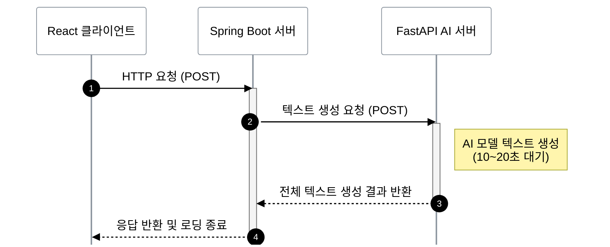
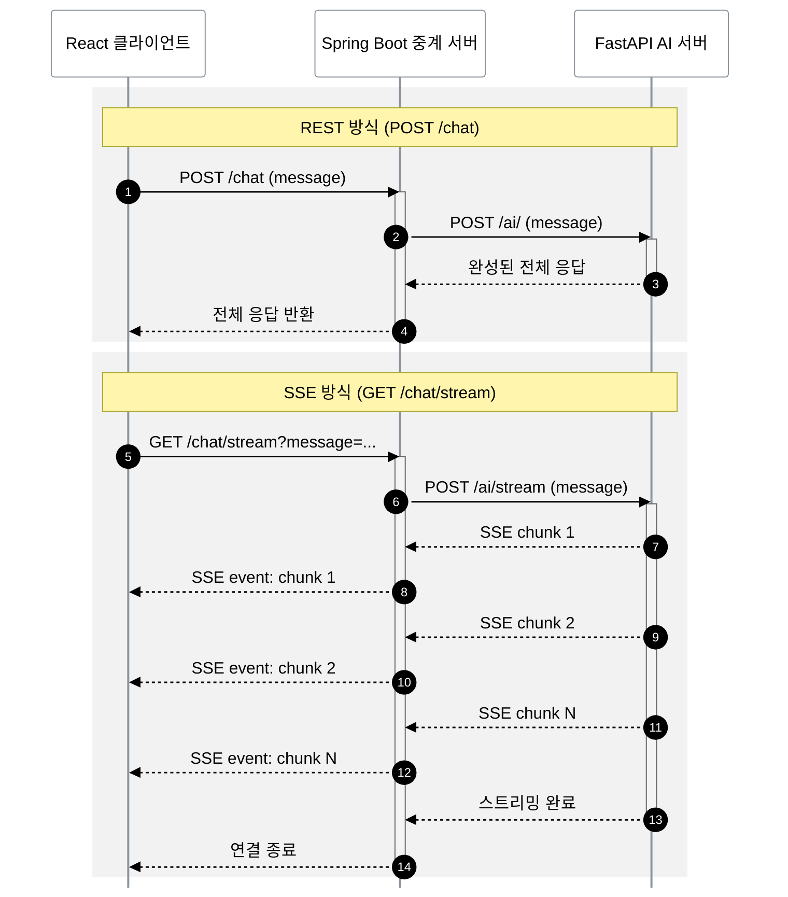

AI를 활용한 유저 인터뷰 및 텍스트 생성 서비스를 개발하면서, 전체 결과가 생성될 때까지 클라이언트가 계속 대기해야 하는 기존의 통신 방식이 만들어낸 UX 문제와 마주하게 되었다. AI 모델의 응답을 기다리는 동안 사용자는 10~20초간 로딩 스피너만 바라봐야 했다. 그렇다고 AI가 응답을 빠르게 할 수는 없었다. 서비스에 맞는 올바른 응답과 퀄리티를 낮출 수는 없었기 때문이다. 이 문제를 SSE(Server-Sent Events)를 도입해 해결한 과정을 정리하고자 한다.

## 1. 도입 배경: AI의 대답을 기다리는 지루한 시간
---

### 기존 구조의 문제점

기존 단일 요청-응답 기반의 통신 구조는 사용자가 상당한 **'답답함'**을 느끼게 만드는 원인이었다. 서비스에서는 클라이언트(React)가 중계 서버(Spring Boot)에 HTTP 요청을 보내고, 중계 서버가 다시 AI 서버(FastAPI)에 텍스트 생성을 요청한 뒤 **모든 응답이 생성될 때까지** 기다렸다가 한 번에 반환하는 방식을 사용했다.


<p align="center" class="text-muted">
  <em>기존 HTTP 요청-응답 통신 흐름</em>
</p>

이러한 동기식 구조에서 발생한 가장 핵심적인 문제는 **너무 긴 체감 대기 시간**이었다. AI 모델이 응답을 생성하기까지 평균 10~20초가 소요되었는데, 사용자는 그 긴 시간 동안 어떤 피드백도 없이 무반응 화면에서 빙글빙글 도는 로딩 스피너만 바라봐야 했다. AI가 정성껏 고품질의 답변을 만들어내더라도, 이미 기다림에 지친 사용자는 긍정적인 UX를 경험하기 어려웠다.

반면, ChatGPT나 Claude 같은 최신 AI 서비스들은 한 글자씩 타이핑되듯 응답이 흘러나오는 '타자기 효과(Typing Effect)'를 제공한다. 이는 "AI가 현재 내 요청을 열심히 처리하고 있다"는 실시간 피드백을 주어 체감 대기 시간을 극적으로 단축시켜주는 효과가 있다고 생각했고, 우리 서비스 역시 이러한 실시간 피드백을 통해 유저의 이탈을 막고 더 나은 몰입감을 제공할 필요가 있었다.

## 2. 기술적 대안 검토: 왜 하필 SSE인가?
---

타자기 효과를 구현하기 위해서는 AI의 응답을 토큰 단위로 쪼개어 실시간으로 전달받을 수 있어야 한다. 다행히 대부분의 LLM API는 두 가지 응답 방식을 지원한다. 하나는 전체 텍스트가 완성된 후 한 번에 반환하는 **일반 응답 방식**이고, 다른 하나는 토큰이 생성될 때마다 즉시 내보내는 **스트리밍 응답 방식**이다. 우리는 후자를 활용하기로 했고, 이 스트리밍 데이터를 클라이언트까지 전달하기 위한 적절한 통신 방식을 선택해야 했다.

실시간 데이터를 클라이언트에 전달하는 대표적인 방식으로는 Polling, WebSocket, SSE가 있다. 각 방식의 특징과 우리 프로젝트에의 적합성을 비교해보자.

### 통신 방식 비교

| 특성 | Polling | WebSocket | SSE |
| :--- | :--- | :--- | :--- |
| **통신 방향** | 단방향 (클라이언트 → 서버) | 양방향 (Full Duplex) | 단방향 (서버 → 클라이언트) |
| **연결 방식** | 매번 새로운 HTTP 요청 | HTTP 핸드셰이크 후 프로토콜 전환 | 지속적 HTTP 연결 |
| **프로토콜** | HTTP | WebSocket (ws/wss) | HTTP |
| **데이터 형식** | JSON 등 | 텍스트 + 바이너리 프레임 | 텍스트(`text/event-stream`) |
| **구현 복잡도** | 낮음 | 높음 | 낮음 |
| **자동 재연결** | 직접 구현 필요 | 직접 구현 필요 | 브라우저 내장 지원 |
| **브라우저 연결 제한** | 없음 | 없음 | 동일 도메인당 6개 (HTTP/1.1) |
| **적합한 사례** | 낮은 빈도의 업데이트 | 양방향 실시간 통신 (채팅 등) | 서버 → 클라이언트 단방향 스트리밍 |

> **참고:** 브라우저 연결 제한은 HTTP/1.1 환경 기준입니다. 최신 HTTP/2 기반 환경에서는 하나의 커넥션에서 멀티플렉싱(Multiplexing)을 지원하기 때문에 이 연결 제한 문제가 실질적으로 해소됩니다.

위 비교표를 바탕으로 각 방식을 우리 프로젝트의 요구사항에 대입해보았다.

먼저 **Polling** 방식은 클라이언트가 일정 간격으로 서버에 "응답이 완성되었나요?"를 반복 질의하는 구조이다. AI 응답이 언제 완료될지 예측할 수 없기 때문에 폴링 주기를 너무 짧게 잡으면 불필요한 요청이 급증하고, 너무 길게 잡으면 응답 수신이 지연된다. 무엇보다 폴링은 여전히 "완성된 응답"을 기다리는 구조이므로, 토큰 단위의 실시간 스트리밍이라는 우리의 목표와는 근본적으로 맞지 않았다.

다음으로 **WebSocket**은 클라이언트와 서버 간 양방향 실시간 통신을 지원하는 강력한 기술이다. 하지만 우리의 요구사항은 "AI가 생성한 토큰을 서버에서 클라이언트로 보내는" 단방향 흐름이었기 때문에, 양방향 통신은 과한 선택이었다. 또한 WebSocket은 HTTP와는 별도의 프로토콜(ws/wss)을 사용하므로 추가 설정이 필요했고, 구현 복잡도도 상대적으로 높았다.

결국 **SSE(Server-Sent Events)**가 우리 상황에 가장 적합한 선택이었다. SSE는 서버에서 클라이언트로의 단방향 스트리밍에 특화되어 있어 우리의 요구사항과 정확히 일치했고, HTTP 프로토콜 위에서 동작하기 때문에 기존 인프라를 그대로 활용할 수 있었다. 브라우저 내장 `EventSource` API를 통해 자동 재연결까지 지원하므로, 구현 복잡도도 낮을 것이라고 판단했다.

### SSE(Server-Sent Events)란?

SSE는 서버에서 클라이언트로 **단방향으로 실시간 데이터를 스트리밍**할 수 있는 웹 표준 기술이다. HTTP 프로토콜 위에서 동작하며, 서버가 `text/event-stream` 형식으로 데이터를 지속적으로 전송한다.

동작 원리는 간단하다. 클라이언트가 서버에 일반 HTTP 요청을 보내면, 서버는 응답의 `Content-Type`을 `text/event-stream`으로 설정하고 **연결을 끊지 않은 채** 데이터를 계속 전송한다. 각 이벤트는 `data:` 필드로 시작하며, 빈 줄(`\n\n`)로 이벤트 간 구분이 이루어진다.

```
// SSE 데이터 포맷 예시
data: {"token": "안녕"}

data: {"token": "하세요"}

data: {"token": ", 무엇을"}

data: [DONE]
```

클라이언트 측에서는 브라우저에 내장된 [`EventSource`](https://developer.mozilla.org/en-US/docs/Web/API/EventSource) API를 통해 이 스트림을 수신할 수 있다. `EventSource`는 연결이 끊어졌을 때 자동으로 재연결을 시도하는 기능도 내장하고 있어, 별도의 재연결 로직 없이도 안정적인 실시간 수신이 가능하다.

[이전 포스팅](/posts/websocket/)에서 WebSocket의 동작 원리를 다뤘었는데, SSE와는 근본적인 차이가 있다. WebSocket은 HTTP 핸드셰이크 이후 완전히 별도의 프로토콜(ws/wss)로 전환되어 양방향 통신을 수행한다. 반면 SSE는 프로토콜 전환 없이 일반 HTTP 연결 위에서 서버가 클라이언트로 데이터를 계속 흘려보내는 방식이다. 우리처럼 "서버에서 클라이언트로 토큰을 스트리밍"하는 단방향 흐름에는 SSE가 훨씬 가볍고 단순한 선택이었다.

### 우리 프로젝트에 SSE를 선택한 이유

앞선 비교 분석을 종합하면, 우리 프로젝트에 SSE가 적합했던 핵심 이유는 다음 세 가지로 정리할 수 있다.

1. **단방향 스트리밍만 필요했다**
   - AI 응답은 서버에서 클라이언트로 흘러가는 단방향 흐름이다. 클라이언트가 스트리밍 도중에 서버로 데이터를 보낼 필요가 없었기 때문에, SSE의 단방향 특성이 우리 요구사항과 정확히 맞아떨어졌다.

2. **HTTP 기반이라 기존 인프라를 그대로 활용할 수 있었다**
   - SSE는 일반 HTTP 위에서 동작하므로, WebSocket처럼 별도의 프로토콜 업그레이드나 추가적인 인프라 설정이 필요하지 않다는 점이 큰 장점이었다.

3. **구현 복잡도가 낮았다**
   - 서버 측에서는 Spring Boot의 `SseEmitter`, 클라이언트 측에서는 브라우저 내장 `EventSource` API만으로 간결하게 구현이 가능했다. 특히 `EventSource`는 연결이 끊어졌을 때 자동으로 재연결을 시도하는 기능을 내장하고 있어, 별도의 재연결 로직을 작성할 필요가 없었다.


## 3. 전체 시스템 아키텍처 흐름
---

SSE를 선택한 이유는 명확해졌으니, 이제 실제로 어떻게 구현하는지 살펴보자. 다만, 실제 프로젝트는 직접 시연하기 어렵고, 이 글의 주제를 벗어나는 로직도 많아 SSE의 핵심만 빠르게 파악하기 어려울 것 같았다. 그래서 전체 구조(React → Spring Boot → FastAPI)는 실제 프로젝트와 동일하되, SSE 스트리밍 구현과 일반 HTTP 요청-응답 방식과의 **TTFB(Time To First Byte) 차이**를 직관적으로 비교할 수 있는 간단한 토이 프로젝트를 별도로 구성했다. 각 컴포넌트의 역할은 다음과 같다.

| 컴포넌트 | 기술 스택 | 역할 |
| :--- | :--- | :--- |
| **React 클라이언트** | React + TypeScript + Vite | REST /SSE 두 방식으로 동시 요청을 보내고, TTFB와 전체 응답 시간을 측정하여 비교 |
| **Spring Boot 중계 서버** | Spring Boot + WebFlux | 실제 프로젝트에서는 인증/인가 및 기타 도메인 로직도 담당하지만,<br>이 글에서는 AI 서버와의 SSE 중계 역할에 집중한다 |
| **FastAPI AI 서버** | FastAPI + LangChain (Gemini) | 실제 프로젝트에서는 사용자 입력을 평가하고 답변에 따라 질문을 분기하는 로직이 포함되어 있지만,<br>토이 프로젝트에서는 단순히 AI 응답을 전달하는 역할만 수행한다 |


<p align="center" class="text-muted">
  <em>REST vs SSE 아키텍처 비교 다이어그램</em>
</p>

기존 HTTP 요청-응답 방식과 다르게, SSE 스트리밍에서는 각 레이어가 데이터를 버퍼링하지 않고 즉시 다음 레이어로 전달하는 것이 핵심이다. FastAPI가 토큰 하나를 `yield`하면, Spring Boot는 그것을 바로 `ServerSentEvent`로 감싸 클라이언트에 전송하고, 클라이언트는 수신 즉시 화면에 반영한다.

> 전체 소스 코드는 [GitHub 저장소](https://github.com/hyunmuam/blog-code/tree/main/sse-streaming)에서 확인할 수 있다.
{: .prompt-info }


## 4. 단계별 핵심 구현 과정
---

데이터가 흘러가는 방향의 역순(생산자 → 소비자)으로, FastAPI → Spring Boot → React 순서로 구현 과정을 살펴보자.

### 4-1. FastAPI: REST vs SSE 스트리밍 엔드포인트

FastAPI AI 서버는 동일한 LLM 요청에 대해 **두 가지 방식**의 응답을 제공한다. 하나는 전체 응답이 완성된 후 한 번에 반환하는 일반(REST) 방식이고, 다른 하나는 토큰이 생성될 때마다 즉시 전달하는 SSE 스트리밍 방식이다.

먼저 핵심인 서비스 레이어를 보자. LangChain의 `ChatGoogleGenerativeAI` 모델을 사용하여 두 가지 처리 방식을 구현했다.

```python
import json
from typing import AsyncGenerator

from langchain_google_genai import ChatGoogleGenerativeAI
from langchain_core.messages import HumanMessage
from langchain_core.output_parsers import StrOutputParser
from app.core.config import settings

# Initialize the Gemini model
llm = ChatGoogleGenerativeAI(
    model="gemini-3.1-flash-lite-preview",
    api_key=settings.GEMINI_API_KEY,
    temperature=0.7,
)

# LLM과 OutputParser를 연결하여 체인 생성
chain = llm | StrOutputParser()


async def process_message_rest(message: str) -> str:
    """
    LangChain을 사용하여 전달받은 메시지를 Gemini API로 처리하고 응답을 반환합니다.
    REST API의 비동기 처리용 함수.

    Args:
        message (str): 사용자로부터 입력받은 메시지

    Returns:
        str: Gemini API에서 반환되는 결과 문자열
    """
    return await chain.ainvoke([HumanMessage(content=message)])


async def process_message_stream(message: str) -> AsyncGenerator[str, None]:
    """
    LangChain을 사용하여 Gemini API 응답을 실시간으로
    Server-Sent Events(SSE) 포맷(data: {chunk}\n\n)으로
    스트리밍하는 비동기 제너레이터.

    Args:
        message (str): 스트리밍 처리할 사용자의 입력 텍스트

    Yields:
        str: SSE 형식으로 포맷팅된 문자열 데이터 청크
    """
    async for chunk in chain.astream([HumanMessage(content=message)]):
        if chunk:
            yield f"data: {json.dumps(chunk)}\n\n"
```
{: file='ai_service.py'}

핵심 차이는 `chain.ainvoke()`와 `chain.astream()`에 있다. `chain.ainvoke()`는 LLM이 모든 토큰을 생성할 때까지 블로킹한 후 완성된 텍스트를 반환하고, `chain.astream()`은 토큰이 생성되는 즉시 `AsyncGenerator`를 통해 하나씩 `yield`한다. 스트리밍 시에는 각 청크를 SSE 프로토콜의 `data: {내용}\n\n` 형식으로 감싸서 전송한다.

라우터에서는 이 두 서비스를 각각 다른 엔드포인트에 연결한다.

```python
@router.post("/", summary="비스트리밍 단일 응답")
async def generate_endpoint(payload: MessageRequest) -> str:
    result = await process_message_rest(payload.message)
    return result

@router.post("/stream", summary="SSE 스트리밍 응답")
async def stream_endpoint(payload: MessageRequest) -> StreamingResponse:
    return StreamingResponse(
        process_message_stream(payload.message), media_type="text/event-stream"
    )
```
{: file='routes.py'}

스트리밍 엔드포인트에서 `StreamingResponse`의 `media_type`을 `"text/event-stream"`으로 설정하는 것이 중요하다. 이 헤더를 통해 클라이언트(Spring Boot)가 응답을 SSE 스트림으로 인식하고, 청크 단위로 파싱할 수 있게 된다.

### 4-2. Spring Boot: WebClient를 활용한 SSE 중계

Spring Boot 중계 서버는 클라이언트의 요청을 FastAPI로 전달하고, 응답을 그대로 중계하는 역할을 한다. REST와 SSE 두 가지 방식 모두 `WebClient`를 사용하되, 응답을 처리하는 방식이 다르다.

```java
@RestController
@RequestMapping("/chat")
@RequiredArgsConstructor
public class AiChatController {

    private final AiChatService aiChatService;

    // 동기식 요청: 전체 응답 완성 후 한 번에 반환
    @PostMapping
    public String chat(@RequestBody ChatRequest request) {
        return aiChatService.chat(request);
    }

    // SSE 스트리밍 요청: 생성되는 응답을 실시간으로 전달
    @GetMapping(value = "/stream", produces = MediaType.TEXT_EVENT_STREAM_VALUE)
    public Flux<ServerSentEvent<String>> streamChat(@RequestParam String message) {
        return aiChatService.streamChat(message);
    }
}
```
{: file='AiChatController.java'}

SSE 스트리밍을 구현하기 위해 Spring WebFlux를 사용했다. 기존 Spring MVC의 `SseEmitter`로도 SSE를 구현할 수 있지만, WebFlux의 `Flux`를 사용하면 비동기 스트리밍을 더 선언적이고 간결하게 표현할 수 있다. 컨트롤러에서 `Flux<ServerSentEvent<String>>`를 반환하기만 하면, Spring이 각 아이템을 SSE 이벤트로 변환하여 클라이언트에 스트리밍한다.

참고로, [Spring 공식 문서](https://docs.spring.io/spring-framework/reference/web/webmvc/mvc-ann-async.html#mvc-ann-async-reactive-types)에 따르면 Spring MVC에서도 `Flux`와 같은 리액티브 타입을 반환할 수 있다. `text/event-stream` 미디어 타입과 함께 `Flux<ServerSentEvent>`를 반환하면, Spring MVC가 내부적으로 `SseEmitter`와 동일한 방식으로 자동 변환하여 SSE 스트리밍을 처리한다. 즉, 반드시 WebFlux 전용 서버(Netty 등)가 아니더라도 기존 서블릿 기반 환경에서 `Flux`를 활용한 SSE 구현이 가능하다.

```java
@Service
public class AiChatService {

    private final WebClient webClient;

    public AiChatService(WebClient.Builder webClientBuilder) {
        this.webClient = webClientBuilder.baseUrl("http://localhost:8000/ai").build();
    }

    // 동기식: bodyToMono → block()으로 전체 응답을 기다림
    public String chat(ChatRequest request) {
        return webClient.post()
                .uri("/")
                .bodyValue(request)
                .retrieve()
                .bodyToMono(String.class)
                .block();
    }

    // SSE 스트리밍: bodyToFlux로 청크 단위 수신
    public Flux<ServerSentEvent<String>> streamChat(String message) {
        ChatRequest request = new ChatRequest(message);

        ParameterizedTypeReference<ServerSentEvent<String>> type =
                new ParameterizedTypeReference<>() {};

        return webClient.post()
                .uri("/stream")
                .accept(MediaType.TEXT_EVENT_STREAM)
                .bodyValue(request)
                .retrieve()
                .bodyToFlux(type);
    }
}
```
{: file='AiChatService.java'}

`WebClient`는 Spring WebFlux에서 제공하는 비동기 HTTP 클라이언트로, 기존의 `RestTemplate`과 달리 논블로킹 방식으로 HTTP 요청을 처리할 수 있다. 특히 SSE와 같은 스트리밍 응답을 `Flux`로 수신할 수 있어, 실시간 데이터 중계에 적합하다.

서비스 레이어에서 REST와 SSE의 차이가 명확하게 드러난다. `bodyToMono()`의 `Mono`는 **0~1개의 값**을 비동기로 반환하는 타입으로, 전체 응답이 하나의 완성된 결과로 도착하는 REST 방식에 적합하다. 여기에 `.block()`을 호출하면 응답이 올 때까지 현재 스레드를 블로킹하여 동기적으로 결과를 받는다. 반면 `bodyToFlux()`의 `Flux`는 **0~N개의 값**을 비동기 스트림으로 방출하는 타입으로, SSE처럼 데이터가 여러 청크로 나뉘어 도착하는 경우에 적합하다. `accept(MediaType.TEXT_EVENT_STREAM)`을 설정하면 WebClient가 응답을 SSE 이벤트 스트림으로 파싱하여, 각 `data:` 라인을 개별 `ServerSentEvent` 객체로 변환해 `Flux`에 하나씩 방출한다.

### 4-3. React: EventSource를 활용한 실시간 TTFB 비교

클라이언트에서는 동일한 메시지에 대해 REST와 SSE 요청을 **동시에** 보내고, 각 방식의 TTFB(Time To First Byte)와 전체 응답 시간을 측정하여 나란히 비교한다.

```tsx
const handleSubmit = (message: string) => {
  const startTime = performance.now();

  // ── REST 요청 ──────────────────────────────────
  // 전체 응답이 완성된 후 한 번에 반환하는 동기식 방식
  fetch('http://localhost:8080/chat', {
    method: 'POST',
    headers: { 'Content-Type': 'application/json' },
    body: JSON.stringify({ message }),
  })
    .then((res) => {
      const totalTime = performance.now() - startTime;
      return res.json().then((text: string) => ({ text, totalTime }));
    })
    .then(({ text, totalTime }) => {
      // REST는 TTFB ≈ 전체 시간 (응답이 한 번에 도착)
      setRestState({
        status: 'done', content: text,
        timing: { ttfb: totalTime, totalTime },
      });
    });

  // ── SSE 스트리밍 요청 ──────────────────────────
  // 서버가 응답을 청크 단위로 전송 → 실시간으로 표시
  const url = `http://localhost:8080/chat/stream?message=${encodeURIComponent(message)}`;
  const es = new EventSource(url);

  let ttfb: number | null = null;
  let accumulated = '';

  es.onmessage = (event) => {
    // 첫 번째 청크 도착 시점 = TTFB
    if (ttfb === null) {
      ttfb = performance.now() - startTime;
    }
    accumulated += JSON.parse(event.data) as string;

    setSseState((prev) => ({
      ...prev, status: 'streaming', content: accumulated,
      timing: { ttfb, totalTime: null },
    }));
  };

  es.onerror = () => {
    const totalTime = performance.now() - startTime;
    es.close();
    setSseState((prev) => ({
      ...prev, status: 'done',
      timing: { ttfb: prev.timing.ttfb, totalTime },
    }));
  };
};
```
{: file='App.tsx'}

핵심 측정 로직을 살펴보면:

- **REST의 TTFB**: `fetch()`의 `.then()` 도달 시점. 전체 응답이 완성된 후에야 호출되므로, TTFB ≈ 전체 응답 시간이 된다.
- **SSE의 TTFB**: `onmessage`가 **처음** 호출되는 시점. 첫 번째 토큰이 도착하는 즉시 측정되므로, 전체 응답 시간보다 훨씬 짧다.

이 차이가 바로 사용자 체감의 핵심이다. REST 방식에서는 TTFB 동안 사용자가 빈 화면을 보며 기다려야 하지만, SSE 방식에서는 첫 번째 토큰이 도착하는 즉시 화면에 표시되기 시작하므로 "AI가 응답하고 있다"는 피드백을 빠르게 받을 수 있다.


## 5. 트러블슈팅: EventSource의 GET 전용 제약
---

브라우저 내장 `EventSource` API는 가장 기본적인 SSE 클라이언트지만, **GET 요청만 지원**한다는 치명적인 한계가 있다. 실제 프로젝트에서는 사용자의 이전 답변 등 복잡한 컨텍스트를 본문(body)에 담아 서버로 전송해야 했기 때문에, 이 한계를 피해 불가피하게 일반 데이터를 받는 `POST` 엔드포인트와 스트리밍 응답을 받는 `GET` 엔드포인트를 분리해야만 했다.

하지만 이런 제약은 실제 서비스에 곧바로 적용하기엔 무리가 있다. 따라서 이 복잡한 구조를 개선하기 위해, 기능이 제한적인 `EventSource` 대신 **`fetch` API와 `ReadableStream`을 조합하여 POST 요청 하나로도 SSE 스트림을 수신하는 방법**을 아래에서 직접 구현하며 해결해보고자 한다. 이를 통해 단일 엔드포인트로 데이터 전송과 실시간 응답 수신을 모두 처리하여 아키텍처를 깔끔하게 만들어보자.

#### fetch API와 ReadableStream의 결합

앞서 언급했듯이 `EventSource`는 GET 요청만 지원하기 때문에 본문(body)에 복잡한 파라미터나 상태를 담아 보내기 어렵다. 이러한 한계를 극복하기 위해 `fetch` API와 브라우저의 `ReadableStream`을 결합하여 구현할 수 있다.

`fetch`를 사용하면 HTTP 메서드를 `POST`로 지정하고, 인증 토큰이나 복잡한 Body(본문) 데이터도 자유롭게 전송할 수 있다. 여기서 기술적인 핵심은 `fetch` 응답 객체(Response)에 있는 `body` 속성을 다루는 방식이다.

우리가 흔히 `fetch`를 쓸 때 사용하는 `response.json()`이나 `response.text()`는 서버의 전체 응답이 **완전히 도착할 때까지 기다렸다가** 한 번에 파싱하는 통 메서드다. 서버가 데이터를 SSE 방식(`text/event-stream`)으로 끝없이 흘려보낼 때 이런 메서드들을 사용하면 프로미스(Promise)가 영원히 처리(resolve)되지 않고 대기하게 된다.

이런 상황을 해결하는 것이 바로 **`ReadableStream`**이다. `fetch`의 `response.body`는 사실 데이터가 모두 도착하지 않아도 접근할 수 있는 `ReadableStream` 웹 표준 인터페이스를 제공한다. 이는 수신되는 데이터를 메모리에 전부 버퍼링해두지 않고, 네트워크를 타고 데이터 조각(Chunk)이 도착하는 족족 즉시 꺼내 쓸 수 있게 해준다.

따라서 전체 응답을 기다리는 대신 `response.body.getReader()`를 호출해 스트림을 제어할 리더(Reader)를 얻고, 이 리더의 `reader.read()`를 반복적으로 호출하면 서버가 푸시하는 각 바이트 청크를 실시간으로 가로채서 화면에 업데이트할 수 있다.

아래는 `fetch` API와 `ReadableStream`을 활용하여 POST 요청 기반으로 SSE를 수신하도록 수정한 실제 클라이언트(`App.tsx`)의 핵심 로직이다. 요청 취소(AbortController), 청크 버퍼링 파싱, 상태 업데이트 로직이 모두 포함되어 있다.

```tsx
// ── SSE 스트리밍 요청 ──────────────────────────────────
// 서버가 응답을 청크 단위로 전송 → 실시간으로 표시

// 이전 요청 취소
abortRef.current?.abort();
const abort = new AbortController();
abortRef.current = abort;

let ttfb: number | null = null;
let accumulated = '';

try {
  const response = await fetch('http://localhost:8080/chat/stream', {
    method: 'POST',
    headers: { 'Content-Type': 'application/json' },
    body: JSON.stringify({ message }),
    signal: abort.signal,
  });

  if (!response.ok) {
    throw new Error(`HTTP ${response.status}: ${response.statusText}`);
  }

  if (!response.body) {
    throw new Error('Response body is null');
  }

  const reader = response.body.getReader();
  const decoder = new TextDecoder();
  let buffer = '';

  while (true) {
    const { done, value } = await reader.read();
    if (done) {
      buffer += decoder.decode(); // flush: 스트림 종료 후 잔여 멀티바이트 문자 처리
      break;
    }

    buffer += decoder.decode(value, { stream: true });
    // SSE 이벤트는 '\n\n'으로 구분됨
    const parts = buffer.split('\n\n');
    buffer = parts.pop()!; // 마지막 불완전한 부분은 다음 청크와 합칠 것

    for (const part of parts) {
      const lines = part.split('\n');
      for (const line of lines) {
        if (line.startsWith('data:')) {
          const dataValue = line.slice(5).trim(); // 'data:' 제거

          if (ttfb === null) {
            ttfb = performance.now() - startTime;
          }
          
          try {
            accumulated += JSON.parse(dataValue) as string;
          } catch {
            console.warn('JSON 파싱 에러:', dataValue);
            continue;
          }

          setSseState((prev) => ({
            ...prev,
            status: 'streaming',
            content: accumulated,
            timing: { ttfb, totalTime: null }, // 스트리밍 중이므로 totalTime은 아직 null
          }));
        }
      }
    }
  }
} catch (error) {
  if (error instanceof Error && error.name === 'AbortError') {
    console.log('요청이 취소되었습니다.');
  } else {
    console.error('SSE 스트리밍 오류:', error);
  }
} finally {
  const totalTime = performance.now() - startTime;
  setSseState((prev) => ({
    ...prev,
    status: 'done',
    timing: { ttfb: prev.timing.ttfb, totalTime },
  }));
}
```
{: file='App.tsx'}

이 방식을 도입하면 브라우저 내장 `EventSource`의 제약을 벗어나, **단일 POST 엔드포인트**만으로도 복잡한 데이터 서밋(전송)과 실시간 스트리밍 수신을 동시에 처리할 수 있다. 보안 상 중요한 토큰을 Header에 담거나, 복잡하고 길이가 긴 이전 대화 컨텍스트들을 Body에 담아 보내야 하는 실제 서비스 환경에서는 필수적인 접근법이다. 

> **참고:** 클라이언트에서 `POST` 요청을 보내도록 변경함에 따라, Spring Boot의 컨트롤러 역시 데이터를 `@RequestBody`로 받는 `@PostMapping`으로 변경되어야 합니다.

다만 `EventSource`에서는 브라우저가 알아서 해주던 **SSE 이벤트 포맷 파싱("data: " 파싱 등)과 자동 재연결 로직**을 직접 구현해야 한다는 문제가 발생한다. 위 원리를 활용하여 fetch 기반으로 SSE를 쉽게 처리할 수 있게끔 래핑된 라이브러리(예: `@microsoft/fetch-event-source` 등)를 활용하는 것을 추천한다.


## 6. UX 개선 결과
---

직접 구현한 토이 프로젝트를 통해 기존 HTTP 요청-응답(REST) 방식과 SSE 스트리밍 방식의 사용자 경험 차이를 나란히 비교해 보았다.


_왼쪽(REST)은 전체 응답이 완성될 때까지 한 번에 대기하지만, 오른쪽(SSE)은 첫 토큰부터 실시간으로 렌더링된다._

테스트 결과, 전체 응답이 완성되어 화면에 표시되기까지 소요되는 총 시간(Total Time)은 두 방식 모두 약 5~10초 내외로 비슷했다. 하지만 사용자 체감을 결정짓는 **TTFB(Time To First Byte)** 지표에서 극적인 차이가 발생했다.

| 항목 | 개선 전 (HTTP 요청-응답) | 개선 후 (SSE) |
| :--- | :--- | :--- |
| 첫 번째 텍스트 노출 (TTFB) | 약 5~10초 | 약 1초 이내 |
| 전체 응답 완료 시간 | 약 5~10초 | 약 5~10초 (동일함) |
| 사용자 체감 | 긴 기다림 (무한 로딩) | 실시간 타자기 효과 (신뢰도 향상) |

왼쪽의 REST 방식에서는 사용자가 5초 이상의 무의미한 빈 화면(또는 로딩 스피너)을 그저 멍하니 바라봐야만 했다. 반면 SSE를 적용한 우측 화면에서는 1초 이내에 서버로부터 첫 번째 답변의 일부분(Chunk)이 도착하며 곧바로 화면에 텍스트가 표시된다.

기다리는 시간이 동일하더라도 서비스가 나의 요청을 즉각적으로 처리하고 있다는 시각적인 피드백을 제공함으로써 사용자는 긍정적인 몰입감을 느낄 수 있을 것이고 그 결과 서비스 이탈 위험도도 크게 낮출 수 있을 것이다.


## 7. 마무리 및 회고
---
처음으로 유저에게 AI 기능을 제공하는 서비스를 개발하면서 많은 것을 배울 수 있었다. 가장 크게 느낀 점은 SSE가 서버에서 클라이언트로의 단방향 스트리밍에 매우 최적화된 기술이며, AI 응답처럼 "생성 중인 데이터를 실시간으로 전달"해야 하는 요구사항에 완벽하게 부합한다는 것이다.

또한, 성능 지표를 통해 확인했듯 전체 응답 시간이 동일하더라도 "첫 토큰을 얼마나 빠르게 보여주느냐(TTFB)"에 따라 사용자가 느끼는 체감 대기 시간과 전반적인 UX가 극적으로 개선될 수 있다는 점도 큰 수확이었다. 

추가적으로 이번 구현 과정에서 외부 AI 서버(FastAPI)와 통신하기 위해 Spring 환경에서 논블로킹 HTTP 클라이언트인 `WebClient`를 도입해 보았다. 기존 `RestTemplate`과 비교해 어떤 이점이 있고 어떻게 활용할 수 있는지 알아보고 포스팅해봐야겠다.


## 참고
---

[MDN \| Server-Sent Events 사용하기](https://developer.mozilla.org/ko/docs/Web/API/Server-sent_events/Using_server-sent_events)

[Spring 공식문서 \| SseEmitter](https://docs.spring.io/spring-framework/reference/web/webmvc/mvc-ann-async.html#mvc-ann-async-sse)

[LangChain \| Streaming](https://docs.langchain.com/oss/python/langchain/streaming/overview#supported-stream-modes)
